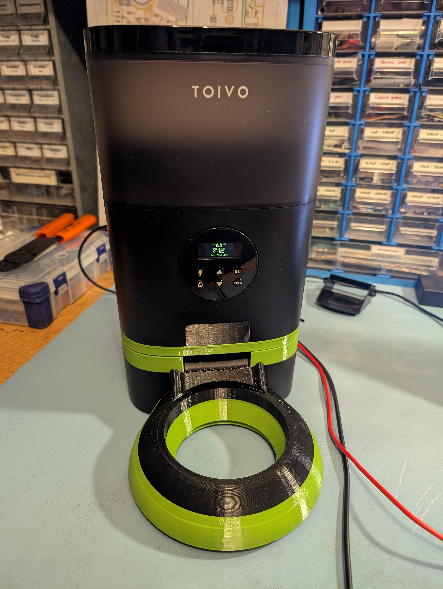
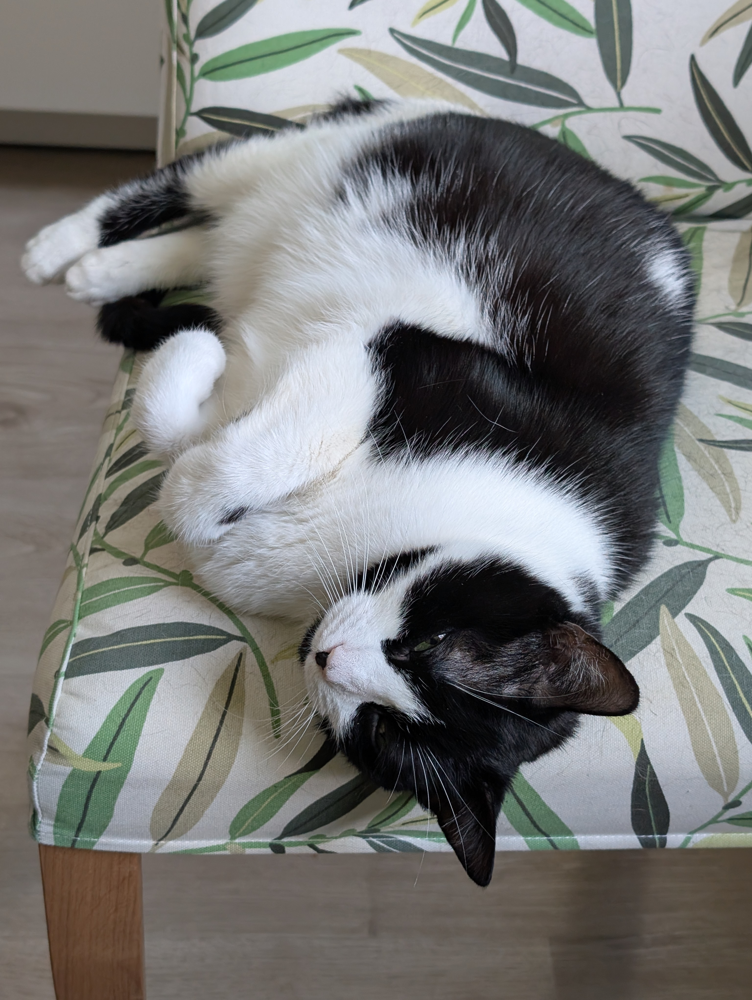

# Automatic cat feeder



An extremely over-engineered kibble feeder for my cat based on a "TOIVO
Automatic Pet Feeder." I would give a more accurate model number, but China;
this is what it says on the sticker. The "over-engineered" part is me adding
three loadcells to accurately keep track of feeding, a color display, and
MQTT for Home Assistant integration.

# Q&A

 - *Could I have bought something off the shelf for half the price?* Yes.
 - *Would it have had a load cell?* No. Why can none of these damn things
   measure how much they dispense? It's not hard. At least not when you
   can change the moldings to actually work with a load cell.
 - *Where's the documentation?* Yes.
 - *Cat?*



# License

```
            DO WHAT THE FUCK YOU WANT TO PUBLIC LICENSE 
                        Version 2, December 2004 

     Copyright (C) 2004 Sam Hocevar <sam@hocevar.net> 

     Everyone is permitted to copy and distribute verbatim or modified 
     copies of this license document, and changing it is allowed as long 
     as the name is changed. 

                DO WHAT THE FUCK YOU WANT TO PUBLIC LICENSE 
       TERMS AND CONDITIONS FOR COPYING, DISTRIBUTION AND MODIFICATION 

      0. You just DO WHAT THE FUCK YOU WANT TO.
```

Good luck and godspeed (also if you're future me and things broke).
